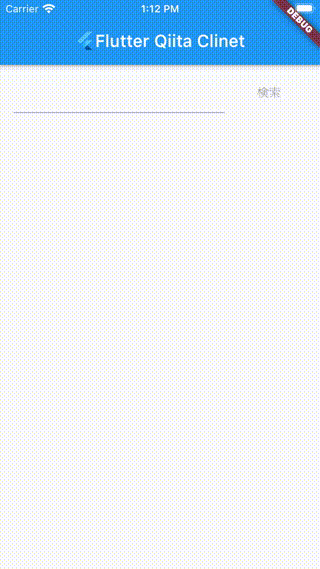

# FlutterQiitaClient

https://github.com/BetaComputing/FlutterQiitaClient




## 使用ライブラリ

* flutter_dotenv
  * https://pub.dev/packages/flutter_dotenv
  * https://github.com/java-james/flutter_dotenv
* get_it
  * https://pub.dev/packages/get_it
  * https://github.com/fluttercommunity/get_it
* provider
  * https://pub.dev/packages/provider
  * https://github.com/rrousselGit/provider
* RxDart
  * https://pub.dev/packages/rxdart
  * https://github.com/ReactiveX/rxdart
* Intl
  * https://github.com/flutter/plugins/tree/master/packages/url_launcher
  * https://github.com/dart-lang/intl
* url_launcher
  * https://pub.dev/packages/url_launcher
  * https://github.com/flutter/plugins/tree/master/packages/url_launcher

## 環境変数

プロジェクトルートに `.env` を配置してください。

```
QIITA_BEARER_TOKEN=ここにQiitaのトークンを記述

```

## 開発用コマンド

### ビルド (Android)

```
flutter build apk --debug
```

### ビルド (iOS)

```
flutter build ios --debug
```

### テスト

```
flutter test
```

### フォーマッタ

```
dart format --fix ./
```

### 静的解析

```
flutter analyze
```
